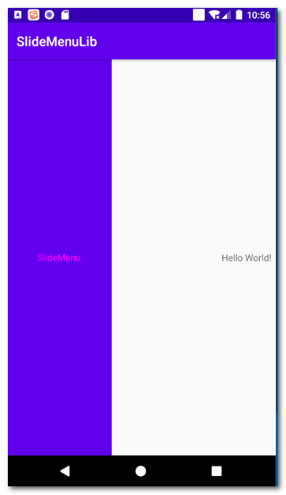

# SlideMenuLib

How to

To get a Git project into your build:

Step 1. Add the JitPack repository to your build file

Add it in your root build.gradle at the end of repositories:

	allprojects {
		repositories {
			...
			maven { url 'https://jitpack.io' }
		}
	}
Step 2. Add the dependency

	dependencies {
	        implementation 'com.github.kuang2010:SlideMenuLib:Tag'
	}
	

Simple Example

   protected void onCreate(Bundle savedInstanceState) {
        super.onCreate(savedInstanceState);
        setContentView(R.layout.activity_main);
        mMenu = new SlidingMenu(this);
        mMenu.setMode(SlidingMenu.LEFT);// 左侧菜单
        mMenu.setTouchModeAbove(SlidingMenu.TOUCHMODE_FULLSCREEN);//屏幕中任何地方都可以拖出slidemenu
        mMenu.setBehindOffsetRes(R.dimen.slidingmenu_offset);// 左侧菜单显示完全后剩余的宽度
        mMenu.setFadeDegree(0.9f);
        mMenu.attachToActivity(this, SlidingMenu.SLIDING_CONTENT);
        mMenu.setMenu(R.layout.layout_menu);
    }

Note SlideMenuLib is from [jfeinstein10/SlidingMenu](https://github.com/jfeinstein10/SlidingMenu)
